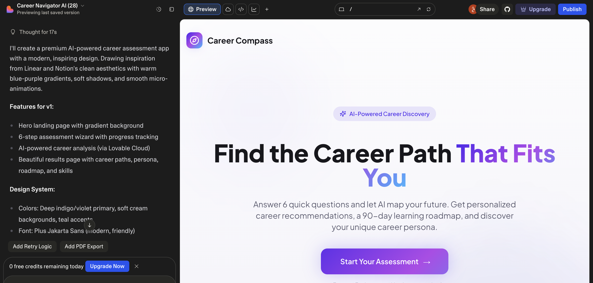
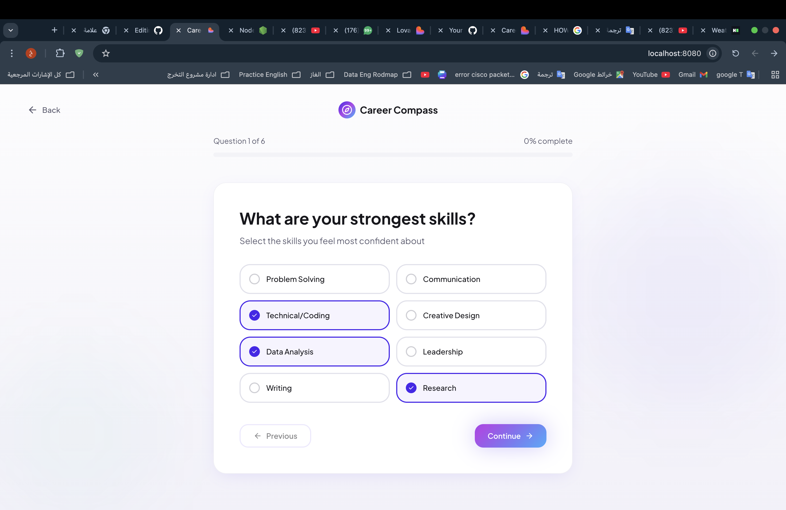
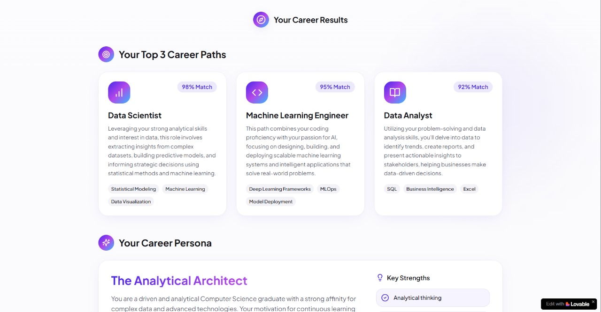
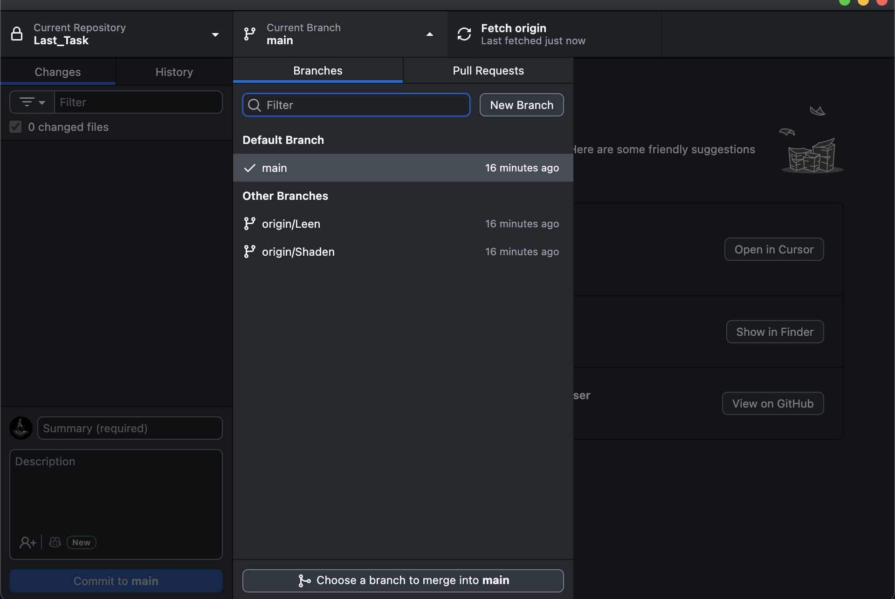

# Career Compass – AI Career Navigator
A modern, elegant web application that helps users discover their ideal career path through a short AI-powered assessment.

---

## Overview
Career Compass is a clean and intuitive career-guidance web app.  
Users answer *6 quick questions*, and the system generates:

- Top 3 recommended career paths  
- A personalized “Career Persona”  
- A 90-day learning roadmap for each path  
- Key skills to focus on next  

The experience feels futuristic, motivational, and highly user-friendly.

**Screenshot (Making the website using lovable):* 

*Screenshot (choosing strength skills):*  

*Screenshot (Result):*  

*Screenshot (Creating Branches):*  

## What technologies are used for this project?

This project is built with:

- Vite
- TypeScript
- React
- shadcn-ui
- Tailwind CSS